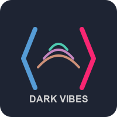
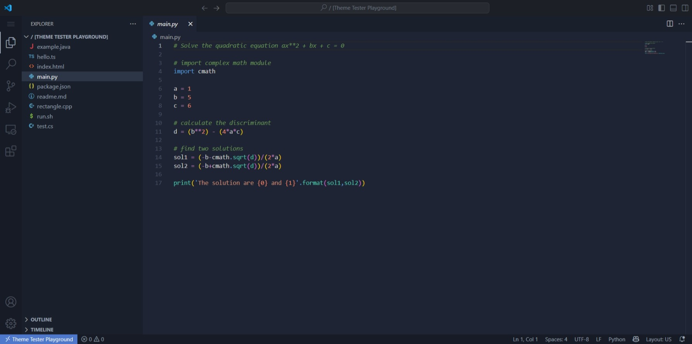
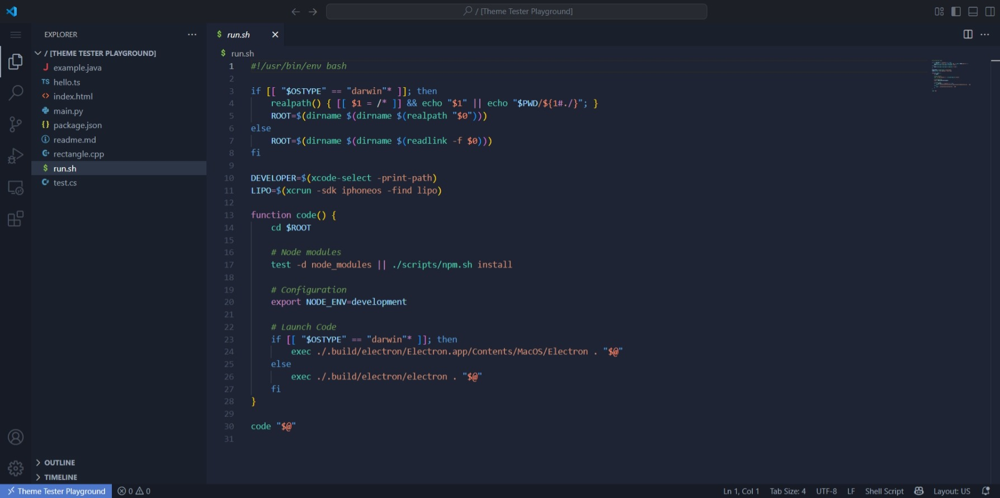
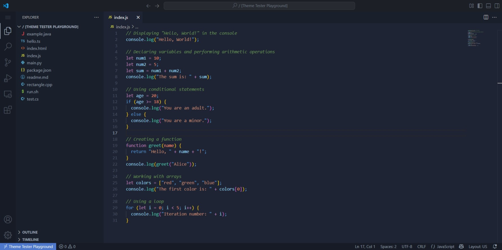
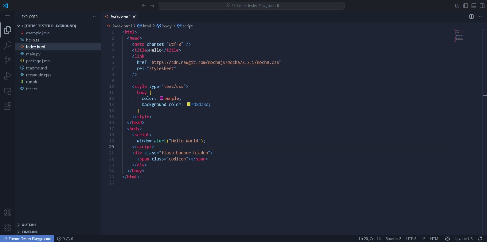
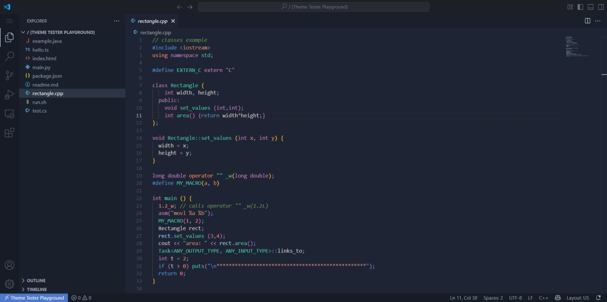

# Dark Vibes Theme for VS Code

<div align="center">



A vibrant dark theme with carefully selected syntax highlighting that's easy on the eyes for long coding sessions.

[](https://marketplace.visualstudio.com/items?itemName=YourPublisherName.dark-vibes-theme)
[](https://marketplace.visualstudio.com/items?itemName=RishabKumar.dark-vibes-theme)
[](https://marketplace.visualstudio.com/items?itemName=RishabKumar.dark-vibes-theme)

</div>

## Installation

1. Open **Extensions** sidebar panel in VS Code (`Ctrl+Shift+X` / `⌘+Shift+X`)
2. Search for `Dark Vibes Theme`
3. Click **Install**
4. Click **Reload** to reload your editor
5. Select the theme via **File > Preferences > Color Theme > Dark Vibes**

## Features

- 🌙 Deep blue-gray background that reduces eye strain
- 🎨 Vibrant syntax highlighting with carefully selected colors
- 💻 Designed for readability in long coding sessions
- 🔄 Consistent highlighting across multiple languages
- 📱 Optimized UI elements for the entire VS Code interface

## Language Support

Dark Vibes provides enhanced syntax highlighting for a wide range of languages including:

- JavaScript/TypeScript
- HTML/CSS
- Python
- Java
- C/C++/C#
- PHP
- Ruby
- Go
- Rust
- JSON/YAML
- Markdown
- And many more!

## Screenshots

### Python


### Bash


### JavaScript/React


### HTML/CSS


### C++


## Color Palette

Dark Vibes uses a carefully crafted color palette:

- Background: `#1E2433`
- Foreground: `#D4D4D4`
- Comments: `#6A9955`
- Functions: `#4EC9B0`
- Keywords: `#C586C0`
- Strings: `#CE9178`
- Variables: `#9CDCFE`
- Numbers/Constants: `#F78C6C`
- Tags: `#F92672`

## Recommended Settings

For the best experience with Dark Vibes, consider the following settings:

```json
{
  "editor.fontFamily": "'Fira Code', Consolas, 'Courier New', monospace",
  "editor.fontLigatures": true,
  "editor.fontSize": 14,
  "editor.lineHeight": 24,
  "editor.cursorBlinking": "phase",
  "editor.cursorSmoothCaretAnimation": true,
  "editor.cursorWidth": 2,
  "editor.smoothScrolling": true
}
```

## Contributing

If you'd like to contribute to this theme, please feel free to submit a PR on [GitHub](https://github.com/rishabkumar7/dark-vibes).

## Issues & Suggestions

For any issues or suggestions, please [open an issue](https://github.com/rishabkumar7/dark-vibes/issues) on GitHub.

## Release Notes

### 0.1.0 (Initial Release)

- Initial release of Dark Vibes
- Support for all major programming languages
- Optimized UI elements and syntax highlighting

---

**Enjoy coding with Dark Vibes!**
